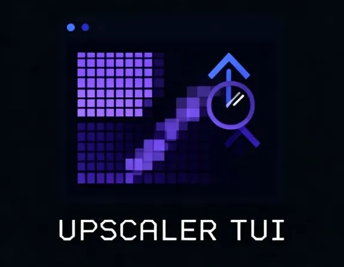

# Upscaler TUI+GUI



A cross-platform GUI for upscaling images with Real-CUGAN and Real-ESRGAN. Runs on Linux and Windows, can choose between Python on the terminal or the Go GUI program.

Three modes: **Guided** (answer a few questions, get a great result), **Expert** (full control over every parameter), and **Try All** (run every model combination and compare).

## Python version:

### Prerequisites

1. Python 3.8+
2. Vulkan runtime (required by the binaries)

Install dependencies:

```bash
pip install -r requirements.txt
```

### Usage

```bash
python app.py
```

Or, if installed via `pip install -e .`:

```bash
upscaler
```

## Go version:

### Prerequisites

- Vulkan runtime (required by the upscaling binaries)
- Linux: `libGL`, `libX11`, and friends — already present on any desktop Linux

No Python. No pip. Just run the binary.

### Building from source

**Linux:**

```bash
# Install Fyne build dependencies (Fedora)
sudo dnf install mesa-libGL-devel libXcursor-devel libXrandr-devel \
                 libXinerama-devel libXi-devel libXxf86vm-devel

make linux
```

**Windows** (cross-compiled from Linux):

```bash
# Install mingw-w64 (Fedora)
sudo dnf install mingw64-gcc

make windows
```

**Both at once:**

```bash
make all
```

Output: `upscaler-linux` and `upscaler-windows.exe`.

### Usage

Place the binary next to the `bin/` directory (already set up in this repo) and run it.

```
upscaler-linux
```

On Windows, run `upscaler-windows.exe`. The DLLs in `bin/` (`vcomp140.dll`, `vcomp140d.dll`) must stay alongside the binary.

Run without arguments to open the GUI. Pass any flag to use the CLI instead.

### CLI

The Go binary doubles as a command-line tool — no GUI is opened when arguments are passed.

**Guided mode** — same presets as the GUI, choose by image type:

```bash
upscaler --input photo.jpg --type photo
upscaler --input ./frames --type anime --scale 4 --tta --output ./out
```

Valid types: `photo`, `illustration`, `anime`, `not_sure`.
`--scale` is optional and defaults to the recommended value for the chosen type.

**Expert mode** — full control:

```bash
upscaler --input ./dir --engine realcugan --model models-se --scale 2 --noise -1
upscaler --input img.jpg --engine realesrgan --model realesrgan-x4plus-anime --scale 4 --tta
upscaler --input img.jpg --engine realesrgan --model realesrnet-x4plus --scale 4 --gpu 0 --threads 2:2:2
```

`--noise` is required for `realcugan` (values: `-1`, `0`, `1`, `2`, `3`).

**Try All** — run every model combination and print a results table:

```bash
upscaler --input ./dir --try-all --output ./results
```

**All flags:**

| Flag | Description |
|------|-------------|
| `--input` | Input file or directory (required) |
| `--type` | Guided mode: `photo`, `illustration`, `anime`, `not_sure` |
| `--engine` | Expert mode: `realcugan` or `realesrgan` |
| `--model` | Model name (see Models section below) |
| `--scale` | Scale factor: `2`, `3`, `4` |
| `--noise` | Noise level for realcugan: `-1`, `0`, `1`, `2`, `3` |
| `--tta` | Maximum quality mode (~8x slower) |
| `--gpu` | GPU ID (`0`, `1`, … or `-1` for CPU) |
| `--threads` | Thread count, e.g. `2:2:2` |
| `--output` | Output directory (default: same as input) |
| `--try-all` | Run all model combinations |

`Ctrl+C` cancels cleanly in all modes.

## Modes

### Guided mode

The easiest way to get started. Answer a few questions and the tool picks the right model automatically.

1. Choose what you are upscaling: photo, illustration, anime, or not sure
2. Choose the scale factor
3. Choose quality: Balanced (faster) or Maximum (~8x slower, uses TTA)
4. Optionally set a custom output directory

You can save your choices as a named preset and reload them next time.

### Expert mode

Full control. Choose the engine (Real-CUGAN or Real-ESRGAN), model, scale, noise reduction (Real-CUGAN only), TTA, GPU ID, and thread count.

GPU ID: `0`, `1`, etc. for specific GPUs; `-1` to force CPU.
Threads: `load:proc:save` format, e.g. `2:2:2`. Leave empty for defaults.

### Try All

Runs every valid model/scale/noise combination and shows a results table at the end. Useful for comparing outputs and picking the best model for your image.

## Models

**Real-CUGAN** — best for anime and manga

| Model | Scale | Noise levels |
|-------|-------|--------------|
| Standard (SE) | 2x, 3x, 4x | No reduction, light, medium, strong, very strong (2x); no reduction, light, very strong (3x, 4x) |
| Professional (Pro) | 2x, 3x | No reduction, very strong |

**Real-ESRGAN**

| Model | Scale | Best for |
|-------|-------|----------|
| Realistic photos — general purpose | 4x | Photos, realistic images |
| Anime / illustrations — sharp lines | 4x | Digital art, illustrations |
| Anime video — for video frames | 2x, 3x, 4x | Anime video frames |
| Realistic photos — variant | 4x | Photos (alternative model) |

Note: the two photo models use a smaller tile size automatically to avoid crashes on AMD iGPUs.

## Output files

Output files are saved next to the input by default. You can specify a custom output directory in any mode.

Filename format:
- Guided: `{name}_guided_{type}_{scale}x.{ext}` — e.g. `photo_guided_anime_2x.png`
- Expert: `{name}_realcugan_{model}_n{noise}_s{scale}.{ext}` — e.g. `photo_realcugan_models-se_n-1_s4.png`

## Saved presets

Guided mode lets you save your settings (image type, scale, quality) as a named preset in `presets.json` next to the binary. On the next run, load a preset to skip the questions.

The format is compatible with presets saved by the original Python version of this app.

## Binary layout

The `bin/` directory must stay next to the executable and contain:

```
bin/
  realcugan-ncnn-vulkan        (Linux)
  realcugan-ncnn-vulkan.exe    (Windows)
  realesrgan-ncnn-vulkan       (Linux)
  realesrgan-ncnn-vulkan.exe   (Windows)
  jpeg2png                     (Linux, optional — improves JPEG quality for anime)
  jpeg2png.exe                 (Windows, optional)
  vcomp140.dll                 (Windows runtime, required)
  vcomp140d.dll                (Windows runtime, required)
  models-se/                   (Real-CUGAN SE models)
  models-pro/                  (Real-CUGAN Pro models)
  models/                      (Real-ESRGAN models)
```

All models are already included in the repository, downloaded from the [Real-CUGAN releases](https://github.com/xinntao/Real-CUGAN-ncnn-vulkan/releases) and [Real-ESRGAN releases](https://github.com/xinntao/Real-ESRGAN-ncnn-vulkan/releases).

## License

This program is free software: you can redistribute it and/or modify it under the terms of the GNU General Public License as published by the Free Software Foundation, either version 3 of the License, or (at your option) any later version.

See [LICENSE](LICENSE) for full text.
